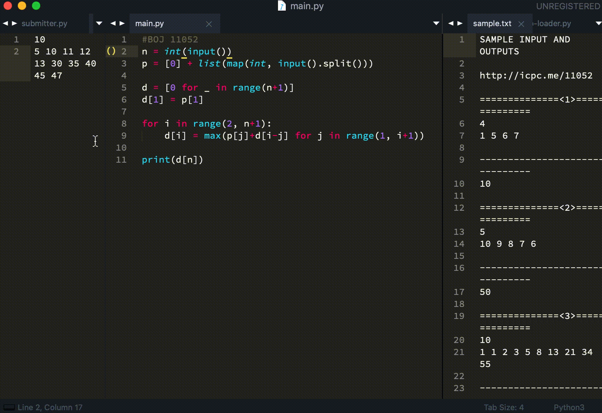

# Motivation

1. 매번 예제 입력을 복사/붙여넣기해서 코드를 실행하는 건 상당히 귀찮은 일입니다.
2. 매번 '제출' 메뉴에 들어간 뒤 코드 전체를 복사/붙여넣기해서 제출하는 건 상당히 귀찮은 일입니다.

# How it works

## Motivation #1의 자동화: ```sample-io-loader.py```

  
*GIF가 상당히 느립니다. 실행시간을 참고해주세요.*

1. ```input.txt```에 문제 번호를 쓰고 저장
2. ```sample-io-loader.py``` 실행
3. ```input.txt```에는 첫 번째 예제입력, ```sample.txt```에는 전체 예제 입력/출력 로드

소스의 기본 빌드커맨드를 ```python main.py < input.txt```로 하면 ```input.txt```의 내용을 ```input()```으로 읽어올 수 있습니다.

## Motivation #2의 자동화: ```submitter.py```

  
*GIF가 상당히 느립니다. 실행시간을 참고해주세요.*

1. ```pass.txt``` 첫 줄에 BOJ 아이디, 둘째 줄에 비밀번호를 쓰고 저장
2. ```submitter.py``` 실행
3. 코드가 ```sample.txt```에 쓰여있는 문제 번호를 보고, 자동으로 BOJ 로그인 후 코드 제출

구체적으로는 
```bash
python submitter.py 'language' 'source/relative/location'
```  
과 같이 첫 번째 인수는 언어 이름, 두 번째 인수는 소스코드의 상대경로를 넣어 실행합니다. 인수 없이 실행하면 기본값은 'Python 3', 'main.py'입니다.

# Prerequisites

- Python 3
- Beautiful Soup: ```pip install bs4```
- Requests: ```pip install requests```
